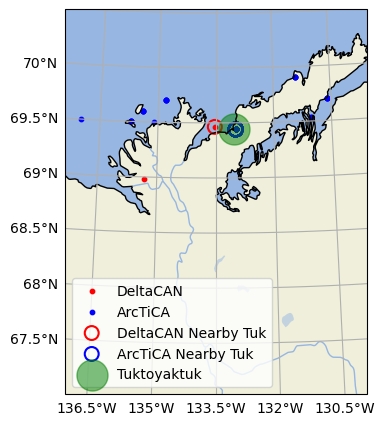

# ArcticDeltas

The first case focuses on researching the conditions of the Mackenzie Delta region, specifically near Tuktoyaktuk. The justification for using data from Tuktoyaktuk lies in its proximity to the Mackenzie Delta’s river mouth. According to the DeltaCAN satellite-extracted dataset (2025) [1] and the ArcTiCA dataset (2024) [2], which includes both satellite and buoy station data, Tuktoyaktuk—an Inuvialuit Hamlet community—provides relevant and reliable observations for this study appeared in both data set.

Tuktoyaktuk experiences a mixed semidiurnal tide cycle, with two high and two low tides per day of varying heights. Observations from the Canadian Hydrographic Service (CHS) indicate that tidal heights can reach up to 0.86 m, with seasonal variations influenced by sea ice cover and proximity to shore [3]. Data from DeltaCAN and ArcTiCA estimate an approximate tidal range of 0.39 m, highlighting the variability caused by the region's extreme climate conditions. The influence of ice cover on tidal patterns is well-documented by Godin & Barber (1980), who found that during ice-free months, semi-diurnal tidal amplitude increases by 50% compared to ice-covered months, where diurnal components dominate [4]. This seasonal dependence results from ice friction and mass loading, which dampen specific tidal responses.

The hamlet of Tuktoyaktuk, located between the Beaufort Sea and the Mackenzie Delta river mouth, experiences an Arctic wave climate driven by seasonal sea and river ice coverage. During ice-free months (typically June–October)[4], wave heights range from 1–3 meters, with wave periods of 8–10 seconds, primarily influenced by distant storm systems. The prevailing wave direction is from the northwest to west, following the dominant fetch over the Beaufort Sea. This wave activity drives longshore sediment transport in a northeast direction, contributing to sandbar and spit formation along the coastline[5].

### References

[1] Bendixen, M., Roberge, B., Park, J. et al. ‘DeltaCAN - A new data set of Canadian Arctic and subarctic coastal deltas’. Sci Data 12, 119 (2025). https://doi.org/10.1038/s41597-025-04458-2

[2] Hart-Davis, M.G., Howard, S.L., Ray, R.D. et al. ArcTiCA: Arctic tidal constituents atlas. Sci Data 11, 167 (2024). https://doi.org/10.1038/s41597-024-03012-w

[3] https://www.marees.gc.ca/tides/en/stations/06485

[4] Godin, G., & Barber, F. G. (1980). Variability of the Tide at Some Sites in the Canadian Arctic. Arctic, 33(1), 30–37. http://www.jstor.org/stable/40509273

[5] D.Whalen, D.L.Forbes, V.Kostylev, M.Lim, P.Fraser, M.R.Nedimović, and S.Stuckey. 2022. Mechanisms, volumetric assessment, and prognosis for rapid coastal erosion of Tuktoyaktuk Island, an important natural barrier for the harbour and community. Canadian Journal of Earth Sciences. 59(11): 945-960. https://doi.org/10.1139/cjes-2021-0101